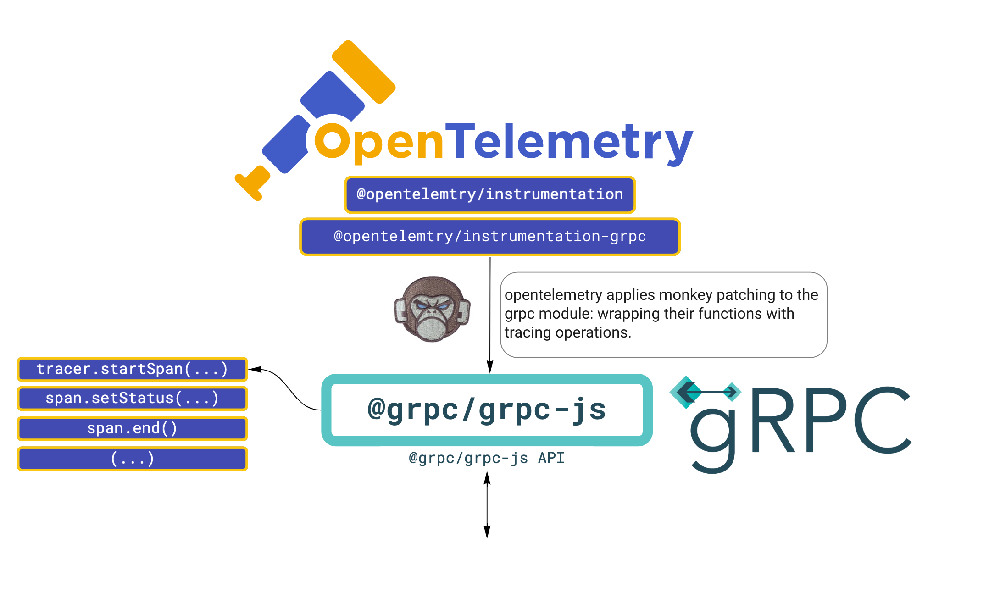
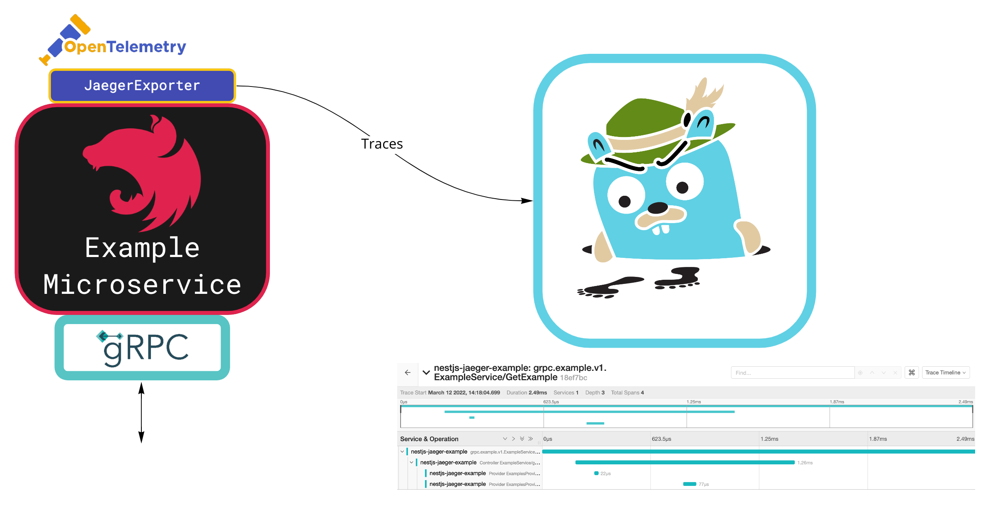

## Requirements

* Typescript and NodeJS understanding
* Basics understanding of NestJS (recommended)

# Setting up NestJS

First to get started with **NestJS** let's install their CLI.
```bash
npm i -g @nestjs/cli
```

Now we can initialize an empty project.
```bash
nest new nestjs-jaeger-example && cd nestjs-jaeger-example
```

# gRPC and Protobuf

**gRPC** by default works with the **protobuf** protocol, which enables you to define language agnostic schemas for your APIs. 
Protobuf not only defines the data schema but also the service schema, which is very powerful.
This is a great way to decouple the API definition from the client and server implementation, and it shines in multi-language backend environment.


Let's create a our protobuf under `proto/example/v1/example.proto`, with the following directory strucutre:
```
|___ src
|___ test
|___ proto
|___ package.json
```
```protobuf
// proto/example/v1/example.proto
syntax = "proto3";

package example.v1;

service ExampleService {
  rpc GetExample(GetExampleRequest) returns (GetExampleResponse) {}
}

message GetExampleRequest {
  int32 integer_data = 1;
}

message GetExampleResponse {
  repeated string string_data = 1;
  bool bool_data = 2;
}
```

To learn more about the protobuf protocol checkout the [protobuf docs](https://developers.google.com/protocol-buffers/docs/overview) and [grpc docs](https://grpc.io/docs/).

## Protobuf Linting

Schema linting is important in an organization, we will also use [buf](https://docs.buf.build/) for linting our protobufs. 

buf is a great tool for managing protobufs, building and linting them. 
The main concept is that you organize you protobufs in modules, and you can add rules to these modules. 
They also have declarative code generation mechanism which is a great way to reduce *protoc* scripts (suites more other languages).

So after setting up our protobuf schema, let's initialize our NestJS microservice:

# NestJS gRPC Setup

Back to our NestJS service.
To setup a gRPC server with NestJS, we will use the [NestJS microservices package](https://docs.nestjs.com/microservices/basics) and the grpc (grpc-js) packages.
```bash
npm i --save @grpc/grpc-js @grpc/proto-loader @nestjs/microservices
```

Let's clean the initialized project and start with a basic setup.

```typescript
// src/main.ts
import { NestFactory } from '@nestjs/core';
import { MicroserviceOptions } from '@nestjs/microservices';
import { AppModule } from './app.module';
import { grpcOptions } from './utils/grpc.options';

async function bootstrap() {
  const app = await NestFactory.createMicroservice<MicroserviceOptions>(
    AppModule,
    grpcOptions,
  );
  await app.listen();
}

bootstrap();
```

```typescript
// src/utils/grpc.options.ts
import { GrpcOptions, Transport } from '@nestjs/microservices';
import * as path from 'path';
import {
  EXAMPLE_PACKAGE,
  EXAMPLE_REL_PROTO_PATH,
} from '../example/example.proto'; // the is described down below

export const PROTO_MODULE_PATH = path.join(__dirname, '..', '..', 'proto');

export const grpcOptions: GrpcOptions = {
  transport: Transport.GRPC,
  options: {
    package: [EXAMPLE_PACKAGE],
    protoPath: path.join(PROTO_MODULE_PATH, EXAMPLE_REL_PROTO_PATH),
    url: 'localhost:3000',
  },
};
```

```typescript
// src/example/example.proto.ts
import * as path from 'path';

/* These are the typescript interfaces that describe the protobuf contents */

export interface GetExampleRequest {
  integerData: number;
}

export interface GetExampleResponse {
  stringData: string[];
  boolData: boolean;
}

export const EXAMPLE_PACKAGE = 'example.v1';
export const EXAMPLE_REL_PROTO_PATH = path.join(
  'example',
  'v1',
  'example.proto',
);
```

```typescript
// src/app.module.ts
import { Module } from '@nestjs/common';
import { ExampleModule } from './example/example.module';

@Module({
  imports: [ExampleModule],
})
export class AppModule {}
```

Now based on the protobuf schema we will implement a basic controller that implements that schema.
NestJS abstracts almost perfectly the gRPC protocol from their microservices package.

All we need to do is to follow the naming conventions we applied on the protobufs (or use string arguments, checkout this out in the [docs](https://docs.nestjs.com/microservices/grpc))


```typescript
// src/example/example.controller.ts
import { Controller } from '@nestjs/common';
import { GrpcMethod } from '@nestjs/microservices';
import { GetExampleRequest, GetExampleResponse } from './example.proto';
import { ExampleProvider } from './example.provider';

@Controller()
export class ExampleService {
  constructor(private exampleProvider: ExampleProvider) {}
  @GrpcMethod() // grpc: ExampleService/GetExample
  getExample(req: GetExampleRequest): GetExampleResponse {
    const resp: GetExampleResponse = {
      boolData: this.exampleProvider.getExampleBool(),
      stringData: [this.exampleProvider.getExampleString()],
    };
    return resp;
  }
}
```

This basically concludes the this server setup.

## Manual Testing
We will test it by running it with `npm start`, and a javascript grpc client that will log the server responses.

Here is a test client for our server:
```javascript
// test/example.client.js
const grpc = require('@grpc/grpc-js');
const protoLoader = require('@grpc/proto-loader');
const path = require('path');

const protoPath = path.join(
  __dirname,
  '..',
  'proto',
  'example',
  'v1',
  'example.proto',
);
const packageDefinition = protoLoader.loadSync(protoPath);
const protoDescriptor = grpc.loadPackageDefinition(packageDefinition);
const examplePackage = protoDescriptor['example']['v1'];

const exampleServiceClient = new examplePackage.ExampleService(
  'localhost:3000',
  grpc.credentials.createInsecure(),
);

exampleServiceClient.getExample({ integerData: 123 }, (err, resp) => {
  if (err) {
    throw Error(err);
  } else {
    console.log(JSON.stringify(resp));
  }
});

```

# Jaeger and OpenTelemetry Setup (Tracing)

## How does it work?

### OpenTelemetry Instrumentation
OpenTelemetryJS automatically instruments our gRPC server with spans and traces, by wrapping the gRPC modules with tracing operations.
So instead of calling regular gRPC functions, we will actually call first to opentelemetry to start tracing this function, and then to the actual function.



In OpenTelemetry 0.26.x (and earlier I think), I actually failed to do this integration because of a bug in their instrumentation library. The monkey patching overriden some fields of the object returned by the grpc api, which made this integration totally broken (could not create streaming servers), checkout the [issue](https://github.com/open-telemetry/opentelemetry-js/issues/2580).

### Jaeger as a backend

We will use OpenTelemetry's Jaeger exporter to export the OTEL traces to a Jaeger backend service.
Jaeger is a backend application for tracing (another examples are zipkin, lightstep, etc.), which enables us to view, search and analyze traces.



 For more information checkout [Jaeger docs](https://www.jaegertracing.io/docs/1.32/).

## Setup Opentelemetry

First we need to installing OpenTelemetry packages:

```bash
npm i --save @opentelemetry/{api,sdk-node,auto-instrumentations-node}
```

And the jaeger exporter package:
```bash
npm i --save @opentelemetry/exporter-jaeger
```

Now we will initialize the tracing as described in their [repo](https://github.com/open-telemetry/opentelemetry-js).

```typescript
import * as process from 'process';
import * as opentelemetry from '@opentelemetry/sdk-node';
import { getNodeAutoInstrumentations } from '@opentelemetry/auto-instrumentations-node';
import { Resource } from '@opentelemetry/resources';
import { SemanticResourceAttributes } from '@opentelemetry/semantic-conventions';
import { SimpleSpanProcessor } from '@opentelemetry/sdk-trace-base';
import { JaegerExporter } from '@opentelemetry/exporter-jaeger';

export const initTracing = async (): Promise<void> => {
  const traceExporter = new JaegerExporter();
  const sdk = new opentelemetry.NodeSDK({
    resource: new Resource({
      [SemanticResourceAttributes.SERVICE_NAME]: 'nestjs-jaeger-example',
    }),
    instrumentations: [getNodeAutoInstrumentations()],
    // Using a simple span processor for faster response.
    // You can also use the batch processor instead.
    spanProcessor: new SimpleSpanProcessor(traceExporter),
  });
try { await sdk.start();
    console.log('Tracing initialized');
  } catch (error) {
    console.log('Error initializing tracing', error);
  }

  process.on('SIGTERM', () => {
    sdk
      .shutdown()
      .then(() => console.log('Tracing terminated'))
      .catch((error) => console.log('Error terminating tracing', error))
      .finally(() => process.exit(0));
  });
};

```

The SDK basically initializes everything for you, we only need to import it in the bootstrap function and we're good to go.
```typescript
// src/main.ts
import { NestFactory } from '@nestjs/core';
import { MicroserviceOptions } from '@nestjs/microservices';
import { AppModule } from './app.module';
import { grpcOptions } from './utils/grpc.options';
import { initTracing } from './utils/tracing.init';

async function bootstrap() {
  await initTracing(); // Added tracing here
  const app = await NestFactory.createMicroservice<MicroserviceOptions>(
    AppModule,
    grpcOptions,
  );
  await app.listen();
}

bootstrap();
```

## Deploy Jaeger

Let's setup the jaeger deployment in our package.json using docker.

Jaeger by default is using port 16686/tcp for UI and 6832/udp for collecting traces. 

```json
{
  "scripts": {
    "jaeger:start": "docker run --rm -d --name jaeger -p 16686:16686 -p 6832:6832/udp -e JAEGER_DISABLED=true jaegertracing/all-in-one:1.32",
    "jaeger:stop": "docker stop jaeger"
  },
}
```

That's it. 

Now if you start jaeger and the server, and use the testing client you will get traces on http://localhost:16686.

# Extras

* You can also add manual tracing, if you want to track a specific code block in your flow: 
```typescript
import { Controller } from '@nestjs/common';
import { GrpcMethod } from '@nestjs/microservices';
import { Span, SpanStatusCode } from '@opentelemetry/api';
import { getTracer } from '../utils/tracing.tracer';
import { GetExampleRequest, GetExampleResponse } from './example.proto';
import { ExampleProvider } from './example.provider';

@Controller()
export class ExampleService {
  constructor(private exampleProvider: ExampleProvider) {}
  @GrpcMethod()
  getExample(req: GetExampleRequest): GetExampleResponse {
    return (
      getTracer()
        // startActiveSpan not only starts a span, but also sets the span context to be the newly opened span
        .startActiveSpan(
          'Controller ExampleService/getExample',
          (span: Span): GetExampleResponse => {
            // attributes are key value pairs that can be set on a span
            span.setAttribute('grpc.request', JSON.stringify(req));
            // status of span determines the span status
            span.setStatus({ code: SpanStatusCode.OK, message: 'all good' });
            const resp: GetExampleResponse = {
              boolData: this.exampleProvider.getExampleBool(),
              stringData: [this.exampleProvider.getExampleString()],
            };
            // every span that started must be manually closed
            span.end();
            return resp;
          },
        )
    );
  }
}
```
* You can debug to see if tracing is working with ConsoleSpanExporter instead of JaegerExporter:
```typescript
export const initTracing = async (): Promise<void> => {

  // just switch the trace exporter
  const traceExporter = new ConsoleSpanExporter();

  const sdk = new opentelemetry.NodeSDK({
    resource: new Resource({
      [SemanticResourceAttributes.SERVICE_NAME]: 'nestjs-jaeger-example',
    }),
    instrumentations: [getNodeAutoInstrumentations()],
    spanProcessor: new SimpleSpanProcessor(traceExporter),
  });
```
If the console exporter is working for you but the jaeger exporter is not, try figuring out if there's any problem with the jaeger deployment, or manually config the jaeger exporter as described [here](https://github.com/open-telemetry/opentelemetry-collector-contrib/tree/main/exporter/jaegerexporter).
